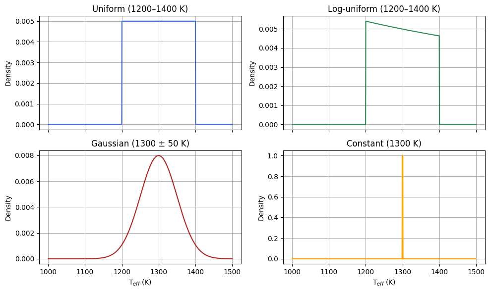
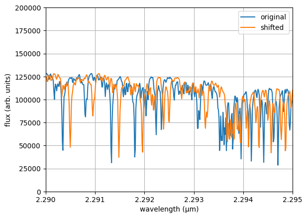
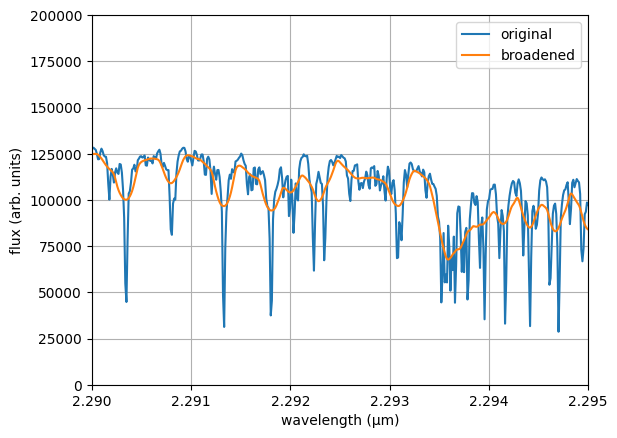

# Knowing the Config

ForMoSA is controlled through a set of **Python dataclasses** — one for each
concern. You can either instantiate them directly in code (preferred) or load
them from an INI file.

## Two ways to configure

### Option A — Python dataclasses (recommended)

```python
from ForMoSA import Analysis
from ForMoSA.config.global_config import (
    ConfigPath, ConfigAdapt, ConfigInversion, ConfigParameters
)

config_path = ConfigPath(
    observation_path  = ["data/obs.fits"],
    adapt_store_path  = "adapted_grid/",
    result_path       = "results/",
    model_path        = "atm_grids/BT-Settl.nc",
)
config_adapt      = ConfigAdapt()
config_inversion  = ConfigInversion(ns_algo="pymultinest", npoints=200)
config_parameters = ConfigParameters(
    par1=["uniform", "500",  "3000"],   # Teff
    par2=["uniform", "2.5",  "5.5"],    # log g
    r   =["uniform", "0.5",  "3.0"],    # radius (R_Jup)
    d   =["constant", "50"],            # distance (pc)
)

analysis = Analysis(config_path)
analysis.adapt(config_adapt, config_inversion)
analysis.nested_sampling(config_parameters, config_adapt, config_inversion)
analysis.plot(analysis.ns.results)
```

### Option B — INI file

```ini
[ConfigPath]
observation_path = data/obs.fits
adapt_store_path = adapted_grid/
result_path      = results/
model_path       = atm_grids/BT-Settl.nc

[ConfigInversion]
ns_algo  = pymultinest
npoints  = 200

[ConfigParameters]
par1 = uniform, 500, 3000
par2 = uniform, 2.5, 5.5
r    = uniform, 0.5, 3.0
d    = constant, 50
```

Load it with:

```python
from ForMoSA.config.global_config import ConfigLoader

loader = ConfigLoader("config.ini")
config_path, config_adapt, config_inversion, config_parameters = loader.load()
```

Generate a template INI file with:

```python
from ForMoSA.config.global_config import ConfigGenerator
ConfigGenerator().save("config_template.ini")
```

## Which dataclass controls what

| Dataclass | Controls |
|-----------|----------|
| `ConfigPath` | File paths: observations, model grid, adapted sub-grids, results |
| `ConfigAdapt` | Grid adaptation: interpolation method, resolution targets, continuum removal, parallelisation |
| `ConfigInversion` | Nested sampling: algorithm choice, live points, likelihood type, fitting wavelength range |
| `ConfigParameters` | Prior distributions for each fitted parameter |

## Prior syntax

Every parameter in `ConfigParameters` accepts a list in the form:

```python
["prior_type", "arg1", "arg2"]
```

| Prior type | Syntax | Description |
|------------|--------|-------------|
| `uniform` | `["uniform", "min", "max"]` | Flat prior between min and max |
| `log_uniform` | `["log_uniform", "min", "max"]` | Flat in log-space |
| `gaussian` | `["gaussian", "mean", "std"]` | Normal distribution |
| `constant` | `["constant", "value"]` | Fixed value, not sampled |
| `NA` | `["NA"]` | Parameter disabled |



## Mode validity matrix

The table below shows which parameters are relevant in each analysis mode.
Parameters marked "No" will be ignored if provided but are not required.

| Parameter | Standard | MOSAIC | Photometry-only | HCHR |
|-----------|:---:|:---:|:---:|:---:|
| `par1`–`par4` | Yes | Yes | Yes | Yes |
| `r` | Yes | Yes | Yes | No |
| `d` | Yes | Yes | Yes | No |
| `rv` | Yes | Yes | No | Yes |
| `vsini` | Yes | Yes | No | Yes |
| `ld` | Yes | Yes | No | Yes |
| `alpha` | Yes | Yes | Yes | No |
| `bb_T` | Yes | Yes | No | No |

In MOSAIC mode, any parameter can be made **instrument-local** by appending
its observation index: `rv_0`, `rv_1`, `alpha_2`, etc. Global parameters
(without a suffix) are shared across all instruments.

## Parameter reference

### `[ConfigPath]`

**`observation_path`** *(list of str or Path)*
: Paths to your `.fits` observation files. Single observation: one-element list.
  MOSAIC mode: one entry per instrument.

**`adapt_store_path`** *(str or Path)*
: Directory where adapted sub-grids are saved. Shared across targets in the
  same sample (see [Folder Structure](folder_structure.md)).

**`result_path`** *(str or Path)*
: Directory where ForMoSA writes results: `ns_results.json`, plots, saved
  observation state.

**`model_path`** *(str or Path)*
: Path to the `.nc` model grid file.

---

### `[ConfigAdapt]`

**`method`** *(str, default `"linear"`)*
: Interpolation method used to resample the model grid onto the observation
  wavelength grid. `"linear"` is robust for most cases.

**`target_res_obs`** *(list, default `["obs"]`)*
: Target spectral resolution for each observation. `"obs"` uses the native
  observation resolution. Provide a float to force a specific resolution.
  One value per observation in MOSAIC mode (or a single value broadcast to all).

**`target_res_mod`** *(list, default `["obs"]`)*
: Target wavelength and resolution for the adapted sub-grid. `"obs"` uses
  the observation wavelength grid; `"mod"` keeps the native model grid.

**`wav_cont`** *(list, default `["NA"]`)*
: Wavelength ranges (in µm) used for continuum estimation and removal. Format:
  `["1.0, 1.3", "1.5, 1.8"]`. `"NA"` disables continuum removal.

**`res_cont`** *(list, default `["NA"]`)*
: Spectral resolution used for the continuum estimate. Must match
  `wav_cont` in length. `"NA"` uses the native grid resolution.

**`backend`** *(str, default `"loky"`)*
: joblib parallelisation backend for grid adaptation. Options: `"loky"`,
  `"multiprocessing"`, `"threading"`, `"sequential"`, `"dask"`, `"ray"`.
  Use `"sequential"` to disable parallelisation for debugging.

**`n_jobs`** *(int, default `-1`)*
: Number of parallel workers. `-1` uses all available CPUs.

---

### `[ConfigInversion]`

**`ns_algo`** *(str, default `"pymultinest"`)*
: Nested-sampling back-end. Options: `"pymultinest"`, `"nestle"`, `"ultranest"`.
  PyMultiNest is recommended for fits with more than three free parameters.

**`npoints`** *(int, default `50`)*
: Number of live points. More points → better posterior sampling and evidence
  estimate, but longer run time. Start with 50–100 for testing; use 300–500
  for publication-quality runs.

**`logL_type`** *(list, default `["chi2"]`)*
: Log-likelihood function. Options: `"chi2"`, `"chi2_covariance"`,
  `"chi2_noisescaling"`, `"chi2_noisescaling_covariance"`, `"CCF_Zucker"`,
  `"CCF_Brogi"`, `"CCF_custom"`.
  One value per observation in MOSAIC mode (or broadcast).

**`wav_fit`** *(list, default `["0.9, 5.0"]`)*
: Wavelength range (µm) used for the likelihood evaluation. Syntax:
  `["min, max"]`. Points outside this range are masked.
  One value per observation in MOSAIC mode.

**`hc_lower_bounds_lsq`** / **`hc_higher_bounds_lsq`** *(list, default `["NA"]`)*
: Lower and upper bounds for the least-squares optimisation in HCHR mode.
  `"NA"` means unbounded. These are only relevant when the observation file has `STAR_FLX`.

---

### `[ConfigParameters]` — fitted parameters

All parameters share the same prior syntax: `["prior_type", "arg1", "arg2"]`.
Set to `["NA"]` to disable.

**`par1`, `par2`, `par3`, `par4`** — grid parameters
: The physical parameters of the atmospheric model grid. What they represent
  depends on the grid (e.g. for BT-Settl: `par1` = T_eff in K, `par2` = log g).
  Check your grid's documentation or inspect the coordinate names with `xarray`.

**`r`** — radius (R_Jup)
: Companion radius. Used in the physical flux scaling: `flux_obs = flux_model × (r / d)²`.
  Requires `d` to be set. Prior example: `["uniform", "0.5", "3.0"]`.

**`d`** — distance (pc)
: Distance to the system. Usually fixed to the Gaia/Hipparcos value.
  Example: `["constant", "50"]`.

**`rv`** — radial velocity (km/s)
: Doppler shift applied to the model spectrum before comparison. Not applicable
  to photometry-only observations.



**`vsini`** — rotational broadening (km/s)
: Rotational broadening applied to the model via a convolution kernel.
  Requires specifying the kernel function as a fourth element:
  `["uniform", "0", "100", "FastRotBroad"]`. You need to define both vsini and ld so that ForMoSA can compute the broadening of the spectral lines. Constraints obtained on this parameter for observations at a resolution <100,000 are not robust for slow rotators. To avoid edge effects during reinterpolation, we also recommend to fit rv as well. Since this parameter can be computationally expensive to fit, ForMoSA allows you to choose between four methods : `RotBroad` or `FastRotBroad` or `Accurate` or `AccurateFastRotBroad`. You should always specify your method after the priors. Please refer to the API documentation for more information.

  

**`ld`** — limb-darkening coefficient
: Linear limb-darkening coefficient applied to the model before scaling.
  Spectroscopic mode only.

**`alpha`** — analytical scaling factor
: Multiplies the model flux by a constant: `flux_obs = flux_model × α`.
  Use instead of `r`+`d` when you do not want to constrain the radius.
  See [Analytical vs Physical Scaling](../scaling/analytical_vs_physical.md).

**`bb_T`** — blackbody temperature (K)
: Adds a blackbody component at temperature `bb_T` to the model spectrum.
  Useful when modelling circumplanetary disk contributions or thermal excess.
