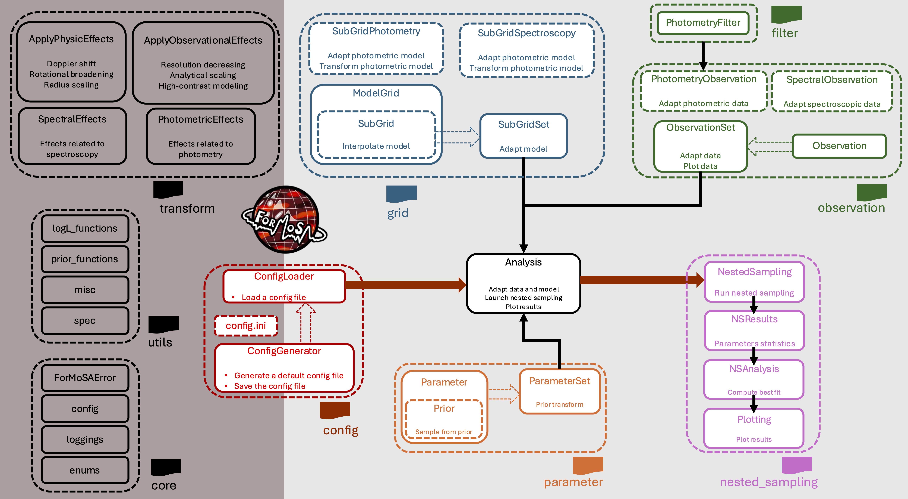

.. ForMoSA documentation master file

.. |br| raw:: html

    

Forward Modeling Tool for Spectral Analysis (ForMoSA)
=====================================================

ForMoSA is an open-source Python package for modeling exoplanetary atmospheres
using a forward modeling approach. It compares observed spectra and photometry
against grids of atmospheric models via nested sampling to derive posterior
distributions on physical parameters.

**Quick links:**
:doc:`getting_started/index` |
:doc:`tutorials/index` |
:doc:`good_practices/index` |
:doc:`api/index` |
:doc:`whats_new`

Features
--------

- **Class-based API** — a single :class:`~ForMoSA.Analysis` entry point manages the full lifecycle: grid adaptation, nested sampling, and plotting.
- **Multi-instrument support (MOSAIC)** — fit spectroscopic and photometric data simultaneously from multiple instruments with per-instrument intercalibration.
- **Three nested-sampling back-ends** — `nestle <http://kylebarbary.com/nestle/>`_, `PyMultiNest <https://github.com/JohannesBuchner/PyMultiNest>`_, and `UltraNest <https://johannesbuchner.github.io/UltraNest/>`_.
- **High-contrast mode** — model stellar speckles and systematics alongside the companion signal.
- **Automatic photometry filters** — filter curves retrieved and cached on the fly from the `SVO Filter Profile Service <https://svo2.cab.inta-csic.es/theory/fps/>`_.
- **Configurable priors** — uniform, log-uniform, Gaussian, and constant priors for every fitted parameter.
- **Comprehensive plotting** — corner plots, chain diagnostics, radar diagrams, best-fit spectra, CCFs, and :math:`\mathrm{RV}-v \sin i` maps.
- **Flexible configuration** — Python dataclasses or INI files; both load into the same objects.

Why ForMoSA?
------------

.. list-table::
   :widths: 5 95
   :header-rows: 0

   * - 🔭
     - **One tool, every instrument.** From low-resolution photometry to
       high-resolution cross-correlation spectroscopy (GRAVITY, HiRISE, JWST NIRSpec),
       ForMoSA handles them all in a single fit via its MOSAIC multi-instrument mode.

   * - 🪐
     - **Forward modeling on self-consistent grids.** Rather than parameterising
       spectra on the fly, ForMoSA interpolates pre-computed, physically motivated
       atmospheric model grids (BT-Settl, Sonora, ATMO, ExoREM, …). This anchors
       retrieved parameters to established theory.

   * - 📐
     - **Proper Bayesian uncertainties, not best-fit guesses.** Nested sampling
       (PyMultiNest, UltraNest, nestle) delivers joint posteriors and log-evidence
       for rigorous model comparison — not just a χ² minimum.

   * - ⚡
     - **Fast to set up, fast to run.** Grid adaptation is parallelised out of
       the box (joblib / Dask / Ray). A typical fit on a laptop takes minutes to hours,
       not days. Cluster scaling via MPI is supported through PyMultiNest.

   * - 🔬
     - **High-contrast ready.** Native support for the HCHR (High-Contrast
       High-Resolution) regime: stellar speckle templates, telluric transmission
       weighting, and systematic component decorrelation are first-class features.

   * - 🛠
     - **Hackable and extensible.** Every stage — observation loading, grid
       adaptation, likelihood evaluation, plotting — is a clean Python class.
       Custom likelihoods, new parameters, and novel grid formats can be plugged
       in without touching core code.

Statement of Need
-----------------

Recent advances in ground- and space-based observatories now enable routine,
high-quality observations of exoplanet atmospheres across a wide range of
wavelengths and resolutions. ForMoSA was developed to bridge the gap between
these observations and atmospheric models by providing a Bayesian framework to
robustly compare the two.

Unlike retrieval approaches that generate spectra on the fly using highly
parameterized models, ForMoSA adopts a **forward-modeling** approach based on
pre-computed, self-consistent atmospheric model grids — enabling a direct,
model-driven comparison with physically motivated theoretical predictions. The
framework supports simultaneous analysis of heterogeneous datasets (different
instruments, resolutions, and epochs) within a single generalized statistical
framework, making it well-suited for the next generation of high-contrast,
high-resolution instruments.

How Does ForMoSA Work?
----------------------

At its core, ForMoSA interpolates a pre-computed atmospheric model grid at each
nested-sampling iteration, applies physical transformations (Doppler shift,
rotational broadening, extinction, scaling), and evaluates a log-likelihood
against the observations. The posterior distributions on the fitted parameters
emerge naturally from the nested-sampling evidence accumulation.

   **ForMoSA workflow.** The right-hand shaded area shows the core modules
   required for nested sampling; the left dark-grey area contains utility and
   support functions. See the :doc:`api/index` for full module documentation.

Example Results
---------------

.. toctree::
   :maxdepth: 2
   :caption: Contents
   :hidden:

   installation
   getting_started/index
   tutorials/index
   good_practices/index
   api/index
   whats_new

Attribution
-----------

If you use ForMoSA in your research, please cite
`Petrus et al. (2023) <https://ui.adsabs.harvard.edu/abs/2023A%26A...670L...9P/abstract>`_.

Version Track
-------------

For the full, per-commit history, see `CHANGELOG.md
<https://github.com/exoAtmospheres/ForMoSA/blob/main/CHANGELOG.md>`_ (auto-generated
on every push). The summary below covers major-version highlights only.

- ``2.0.0`` Complete rewrite with a class-based API (``Analysis``), Python dataclass
  configuration, restructured package layout, automatic photometry filter retrieval,
  CCF / :math:`\mathrm{RV}-v \sin i` analysis, structured logging, and typed error handling.
  **Not backwards-compatible with v1.x.** See :ref:`whats_new` for the full details.

- ``1.1.6`` Addition of high-contrast models, UltraNest, and automatically generated
  config files.

- ``1.1.2`` Multi-instrument (MOSAIC) and high-spectral-resolution support.

- ``1.0.13`` First operational release, presented at
  `Cloud Academy 3 <https://alienearths.space/cloud-academy-3/>`_.

- ``1.0.5`` First operational release.

Acknowledgements
----------------

The authors express their sincere thanks to the
`Code/Astro Workshop <https://semaphorep.github.io/codeastro/>`_, which provided
the foundational training necessary to transform ForMoSA into a professional,
open-source Python package.

We gratefully acknowledge the funding and support for the ForM-X workshops held
in Nice (2023), Heidelberg (2024/2025), and Grenoble (2025), which were
instrumental in the development and refinement of the code. We also thank the
various laboratories and institutions — especially IPAG, Lagrange, and MPIA —
for their continued support.

This work has been supported by the French National Research Agency (ANR) through
the MIRAGES project (PI: A. Vigan, ANR-20-CE31-0017).

Issues
------

Run into something unexpected? Please open an issue on
`GitHub <https://github.com/exoAtmospheres/ForMoSA/issues>`_. 
